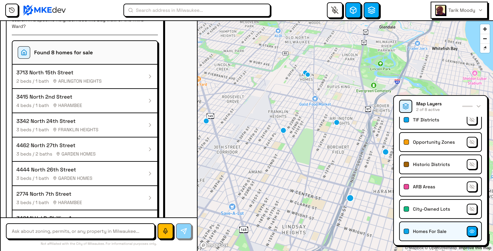
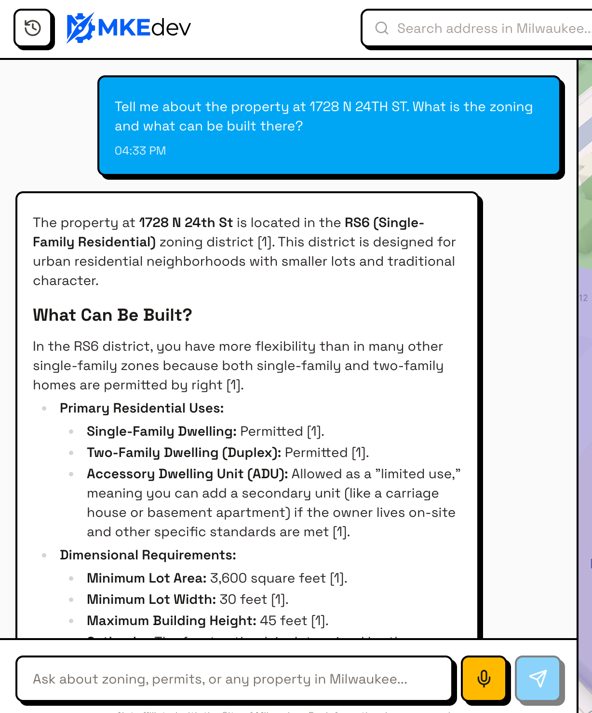
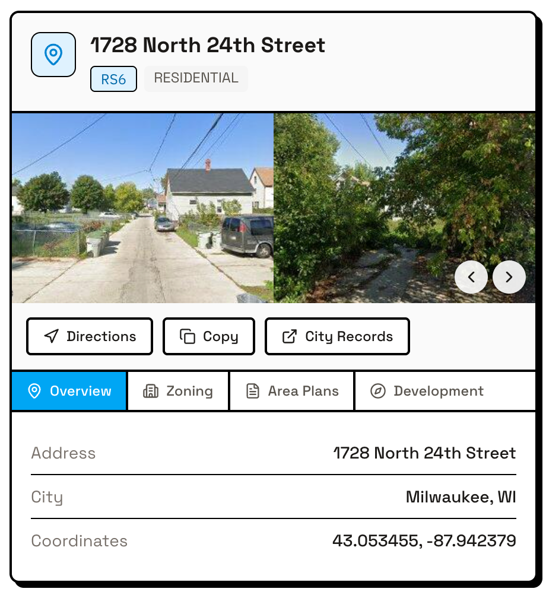
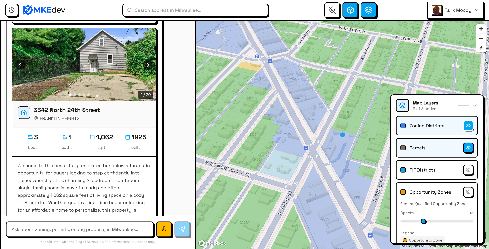

# MKE.dev

> Voice-First AI-Powered Civic Intelligence Platform for Milwaukee


**Gemini 3 Hackathon Entry** | Deadline: February 10, 2026

---

## Overview

MKE.dev democratizes access to Milwaukee's civic development information by transforming complex zoning codes, financial incentives, and regulatory data into a single, intuitive, voice-first conversational experience.



### Key Features

- **AI Site Visualizer** - Generate architectural visualizations with Gemini 3 Pro Image + mask-based inpainting
- **Zoning Interpreter Agent** - AI-powered zoning assistant using Gemini function calling with RAG
- **1M Context + Thinking** - Deep feasibility analysis with Gemini 3's extended context and thinking levels
- **Interactive Map** - Mapbox GL JS with 7 Milwaukee ESRI data layers and PMTiles
- **File Search RAG** - 25+ documents across 5 categories in Gemini File Search Stores (zoning codes, area plans, policies, guides, incentives)
- **Real-Time Geocoding** - Address to zoning lookup via Mapbox + Milwaukee ESRI integration
- **Generative UI Cards** - Rich property cards with Street View, zoning details, and area plans
- **Interactive Street View** - Google Maps integration with 360° navigation and screenshot capture
- **Homes For Sale** - Browse city-owned properties synced from Milwaukee ESRI FeatureServer
- **PDF Report Generation** - Export research as professional PDF reports via Hybiscus API
- **Conversation History** - Persistent chat sessions with search, star, and sidebar navigation
- **Housing Incentives** - Information on STRONG Homes, Homebuyer Assistance, ARCH, and Down Payment programs
- **Chat Onboarding** - Suggested prompts help users discover available information
- **High-Performance Tiles** - PMTiles (313,000+ features) for instant map rendering
- **Voice-First Interface** - Real-time voice conversations via Gemini Live API (in progress)

### Target Users

- **Homeowners** exploring ADUs or renovations
- **Developers** scouting opportunities and analyzing incentives
- **Architects** verifying dimensional standards
- **City Planners** reducing repetitive inquiries
- **Homebuyers** understanding what they can build before purchasing
- **Visually Impaired Residents** seeking independent access to property information

---

## Screenshots

### AI Chat Interface

*Ask questions in natural language. Get detailed answers with specific code references.*

### Property Cards with Street View

*Rich property intelligence with Google Street View, tabbed information, and quick actions.*

### Home Listings

*Browse city-owned homes with photos, property details, and interactive map layers.*

---

## Tech Stack

| Layer | Technology |
|-------|------------|
| Frontend | Next.js 15 (App Router, React 19) |
| UI Components | RetroUI (neobrutalist design) |
| Styling | Tailwind CSS 4 |
| Backend | Convex (real-time database) |
| Auth | Clerk (Google OAuth + email) |
| Maps | Mapbox GL JS + Milwaukee ESRI ArcGIS |
| Tiles | PMTiles on Cloudflare R2 |
| AI/LLM | Google Gemini 3 Flash & Pro |
| Image Gen | Gemini 3 Pro Image (`gemini-3-pro-image-preview`) |
| Voice | Gemini Live API |
| Agents | Google ADK |
| State | Zustand |
| Canvas | Konva.js (mask painting) |
| Generative UI | CopilotKit |
| PDF Generation | Hybiscus API |
| Observability | Comet/Opik |

### Gemini 3 Models Used

| Model | Purpose |
|-------|---------|
| `gemini-3-flash-preview` | Fast queries, RAG, zoning lookups |
| `gemini-3-pro-preview` | Deep analysis with Thinking Levels |
| `gemini-3-pro-image-preview` | Architectural visualization (Site Visualizer) |

---

## Quick Start

### Prerequisites

- Node.js 20+
- pnpm 9+
- [Mapbox account](https://account.mapbox.com/) (free tier works)
- [Clerk account](https://clerk.com/) (free tier works)
- [Convex account](https://convex.dev/) (free tier works)
- [Google Cloud account](https://console.cloud.google.com/) (for Gemini and Maps APIs)

### Installation

```bash
# Clone the repository
git clone https://github.com/tmoody1973/mkedev.git
cd mkedev

# Install dependencies
cd apps/web
pnpm install

# Copy environment template
cp .env.example .env.local
```

### Configure Environment

Edit `apps/web/.env.local` with your API keys:

```bash
# Required - Authentication
NEXT_PUBLIC_CLERK_PUBLISHABLE_KEY=pk_test_xxx
CLERK_SECRET_KEY=sk_test_xxx
CLERK_WEBHOOK_SECRET=whsec_xxx

# Required - Map
NEXT_PUBLIC_MAPBOX_TOKEN=pk.xxx

# Required - AI
GEMINI_API_KEY=xxx

# Required - Database
CONVEX_DEPLOYMENT=dev:xxx
NEXT_PUBLIC_CONVEX_URL=https://xxx.convex.cloud

# Optional - Street View (enable Maps JavaScript API in Google Cloud)
NEXT_PUBLIC_GOOGLE_MAPS_API_KEY=xxx

# Optional - Performance (falls back to ESRI REST API)
NEXT_PUBLIC_PMTILES_URL=https://xxx.r2.dev/milwaukee.pmtiles

# Optional - Observability
OPIK_API_KEY=xxx
OPIK_PROJECT_NAME=mkedev-civic-ai
```

### Google Cloud Setup

For Street View functionality, enable these APIs in [Google Cloud Console](https://console.cloud.google.com/apis/library):
- Maps JavaScript API
- Street View Static API

### Development

```bash
# Start Next.js dev server
pnpm dev

# In a separate terminal, start Convex
pnpm convex dev
```

Visit [http://localhost:3000](http://localhost:3000)

---

## Project Structure

```
mkedev/
├── apps/
│   ├── web/                    # Next.js 15 application
│   │   ├── src/
│   │   │   ├── app/            # App Router pages
│   │   │   ├── components/     # React components
│   │   │   │   ├── chat/       # Chat panel components
│   │   │   │   ├── copilot/    # Generative UI cards (ParcelCard, HomeCard, etc.)
│   │   │   │   ├── landing/    # Landing page with feature showcase
│   │   │   │   ├── map/        # Map and layer components
│   │   │   │   ├── shell/      # App shell and header
│   │   │   │   ├── ui/         # RetroUI components (StreetViewModal, etc.)
│   │   │   │   └── visualizer/ # AI Site Visualizer (Gemini 3 Pro Image)
│   │   │   ├── contexts/       # React contexts (MapContext)
│   │   │   ├── hooks/          # Custom hooks (useZoningAgent, useReportGenerator)
│   │   │   └── stores/         # Zustand stores (visualizerStore)
│   │   ├── convex/             # Convex schema & functions
│   │   │   ├── agents/         # Zoning Interpreter Agent + Context Cache
│   │   │   ├── ingestion/      # RAG & homes sync
│   │   │   ├── visualization/  # Gemini 3 Pro Image generation
│   │   │   └── http/           # HTTP endpoints (webhooks)
│   │   └── scripts/            # Setup scripts
│   └── agents/                 # Google ADK agents (standalone)
├── packages/
│   └── tile-builder/           # ESRI → PMTiles pipeline
├── agent-os/                   # Specs and documentation
│   ├── product/                # Mission, roadmap, tech stack
│   └── specs/                  # Feature specifications
└── data/                       # Documents for RAG
    ├── zoning-code-pdfs/       # Milwaukee Zoning Code (12 PDFs)
    ├── plans/                  # City area plans (13 PDFs)
    └── incentives/             # Housing incentive programs (8 docs)
```

---

## Map Layers

MKE.dev integrates 7 Milwaukee GIS data layers:

| Layer | Source | Description |
|-------|--------|-------------|
| Zoning Districts | ESRI Layer 11 | Color-coded by category (residential, commercial, industrial, mixed-use) |
| Parcels | ESRI Layer 2 | Clickable parcels with property info |
| TIF Districts | ESRI Layer 8 | Tax Increment Financing zones |
| Opportunity Zones | ESRI Layer 9 | Federal opportunity zone boundaries |
| Historic Districts | ESRI Layer 17 | Historic preservation areas |
| ARB Areas | ESRI Layer 1 | Architectural Review Board districts |
| Homes For Sale | ESRI FeatureServer | City-owned properties available for purchase |

Layers are served via PMTiles for optimal performance (313,000+ features).

---

## Zoning Interpreter Agent

The AI-powered Zoning Interpreter Agent helps users understand Milwaukee zoning requirements through natural conversation.

### Agent Tools

| Tool | Description |
|------|-------------|
| `geocode_address` | Convert street addresses to coordinates via Mapbox |
| `query_zoning_at_point` | Get zoning district + overlays from Milwaukee ESRI |
| `calculate_parking` | Calculate required parking spaces by use type |
| `query_zoning_code` | RAG search against 12 zoning code PDFs |
| `query_area_plans` | Search area plan context for a location |
| `search_homes_for_sale` | Find city-owned properties for sale |
| `query_incentives` | Search housing incentive programs (STRONG Homes, etc.) |

### Example Queries

```
"What zoning district is 500 N Water St in?"
→ C9F(A) - Downtown Office and Service

"How many parking spaces for a 5000 sq ft restaurant at that address?"
→ 0 required (downtown), 4 bicycle spaces required

"What are the setback requirements for RS6 residential?"
→ Front: Average, Side: 3-6 ft, Rear: 20 ft (with code citations)

"Show me homes for sale in Harambee"
→ [List of available properties with photos and details]

"What housing assistance programs are available in Milwaukee?"
→ [Details on STRONG Homes Loan, Homebuyer Assistance, ARCH, Down Payment programs]
```

### RAG Document Corpus

25+ documents indexed across 5 Gemini File Search Stores:

| Store | Documents | Content |
|-------|-----------|---------|
| **zoning-codes** | 12 PDFs | CH295 Subchapters 1-11 + Use Tables |
| **area-plans** | 13 PDFs | Neighborhood comprehensive plans |
| **policies** | 2 PDFs | Housing Element, Citywide Policy Plan |
| **guides** | 7 docs | Milwaukee Planning Department guides |
| **incentives** | 8 docs | STRONG Homes, Homebuyer Assistance, ARCH, Down Payment programs |

---

## Generative UI Components

MKE.dev uses CopilotKit for rich, interactive UI cards rendered directly in the chat:

| Component | Description |
|-----------|-------------|
| `ParcelCard` | Property analysis with Street View, zoning, area plans, development standards |
| `HomeCard` | Home listing with photo gallery, property details, map integration |
| `HomesListCard` | Grid of available homes for sale |
| `ZoneInfoCard` | Zoning district details and permitted uses |
| `StreetViewModal` | Interactive 360° Street View with screenshot capture |
| `PDFViewerModal` | View generated PDF reports in-app |

---

## AI Site Visualizer

The Site Visualizer uses **Gemini 3 Pro Image** (`gemini-3-pro-image-preview`) to generate architectural visualizations based on real site photos.

### How It Works

1. **Capture** - Take screenshots from the map (camera button) or Street View (Capture → Visualize)
2. **Gallery** - Browse your screenshots and select one to visualize
3. **Mask** - Paint over the area you want to modify (buildings, vacant lots, etc.)
4. **Prompt** - Describe what to add: "4-story mixed-use building with retail on ground floor"
5. **Generate** - Gemini 3 Pro Image generates a contextual architectural visualization
6. **Compare** - Side-by-side view of original vs AI-generated result

### Visualizer Components

| Component | Purpose |
|-----------|---------|
| `SiteVisualizer` | Full-screen modal with mode switching |
| `VisualizerCanvas` | Konva.js canvas for image + mask layer |
| `MaskToolbar` | Brush/eraser tools with size slider |
| `ImageCapture` | Screenshot gallery + file upload |
| `PromptInput` | Prompt textarea with generate button |
| `GenerationResult` | Side-by-side Original vs AI comparison |
| `ZoningSidebar` | Zoning context for the selected parcel |
| `MapScreenshotButton` | Purple camera button on map |

### Screenshot Sources

| Source | How to Capture |
|--------|----------------|
| Map | Click purple camera button (bottom-left of map) |
| Street View | Open Street View → Navigate → Capture → Visualize |
| File Upload | Click "Upload Your Own" in the gallery |

---

## Environment Variables

| Variable | Description | Required |
|----------|-------------|----------|
| `NEXT_PUBLIC_CLERK_PUBLISHABLE_KEY` | Clerk publishable key | Yes |
| `CLERK_SECRET_KEY` | Clerk secret key | Yes |
| `CLERK_WEBHOOK_SECRET` | Clerk webhook secret | Yes |
| `NEXT_PUBLIC_MAPBOX_TOKEN` | Mapbox access token | Yes |
| `GEMINI_API_KEY` | Google Gemini API key | Yes |
| `CONVEX_DEPLOYMENT` | Convex deployment ID | Yes |
| `NEXT_PUBLIC_CONVEX_URL` | Convex cloud URL | Yes |
| `NEXT_PUBLIC_GOOGLE_MAPS_API_KEY` | Google Maps API key | No* |
| `NEXT_PUBLIC_PMTILES_URL` | PMTiles R2 URL | No** |
| `OPIK_API_KEY` | Comet/Opik API key | No*** |

\* Required for Street View features
\** Falls back to ESRI REST API if not set
\*** Required for LLM observability

---

## Scripts

```bash
# Development
pnpm dev                  # Start Next.js dev server
pnpm convex dev           # Start Convex dev server
pnpm lint                 # Run ESLint
pnpm typecheck            # Run TypeScript type checking
pnpm test                 # Run tests

# RAG Setup (in apps/web directory)
pnpm upload-file-search   # Upload all docs to Gemini File Search
pnpm upload-file-search:status  # Check upload status
npx tsx scripts/upload-incentives.ts  # Upload incentives docs only

# Tile Building (requires tippecanoe)
pnpm --filter tile-builder export    # Export ESRI → GeoJSON
pnpm --filter tile-builder build     # Build PMTiles
pnpm --filter tile-builder upload    # Upload to R2
```

---

## Development Roadmap

### Week 1: Foundation (Complete)
- [x] Monorepo with pnpm workspaces
- [x] Next.js 15 with RetroUI design system
- [x] Clerk authentication
- [x] Convex backend schema
- [x] Mapbox + ESRI layer integration
- [x] Chat panel UI
- [x] PMTiles pipeline

### Week 2: Voice & AI (Complete)
- [x] **Zoning Interpreter Agent** - Gemini function calling with tools
- [x] **File Search RAG** - 12 zoning PDFs in persistent stores
- [x] **ESRI Integration** - Geocoding + zoning lookup
- [x] **Conversation History** - Persistent chat with sidebar, search, and star/delete
- [x] **Generative UI Cards** - ParcelCard, HomeCard with Street View integration
- [x] **Homes For Sale** - ESRI FeatureServer sync with images
- [x] **PDF Report Generation** - Export research via Hybiscus API
- [x] **Interactive Street View** - Modal with 360° navigation and screenshot capture
- [x] **Landing Page** - Feature showcase with app screenshots
- [x] **Housing Incentives RAG** - 8 documents on STRONG Homes, Homebuyer Assistance, ARCH, Down Payment
- [x] **Chat Onboarding** - Suggested prompts for zoning, housing, incentives, area plans
- [x] **Planning Ingestion Agent** - Playwright-based web scraping for Milwaukee planning docs
- [x] **Gemini 3 Context Caching** - 1M token context with full zoning corpus
- [x] **Thinking Levels** - Deep feasibility analysis with exposed reasoning
- [x] **AI Site Visualizer** - Gemini 3 Pro Image with mask-based inpainting
- [x] **Screenshot Gallery** - Map and Street View capture with gallery browser
- [ ] Gemini Live API integration
- [ ] Voice activity detection

### Week 3: Advanced Agents
- [ ] Area Plan Advisor agent
- [ ] Incentives Navigator agent
- [ ] Nano Banana architectural preview
- [ ] Feasibility Analyst meta-agent
- [ ] CopilotKit agent coordination

### Week 4: Polish & Submit
- [ ] Accessibility testing
- [ ] Demo video
- [ ] Submission materials

---

## Contributing

1. Fork the repository
2. Create a feature branch (`git checkout -b feature/amazing-feature`)
3. Commit your changes (`git commit -m 'feat: add amazing feature'`)
4. Push to the branch (`git push origin feature/amazing-feature`)
5. Open a Pull Request

---

## License

MIT License - see [LICENSE](LICENSE) for details.

---

## Disclaimer

This site is not affiliated with, endorsed by, or connected to the City of Milwaukee. Information provided is for educational purposes only and should not be considered official city guidance.

---

## Acknowledgments

- **City of Milwaukee** - Open GIS data via [Milwaukee Maps](https://city.milwaukee.gov/DownloadMapData)
- **RetroUI** - Neobrutalist component library
- **Mapbox** - Map rendering and interaction
- **Google** - Gemini AI and Maps APIs
- **CopilotKit** - Generative UI framework
- **Anthropic** - Claude AI assistance in development

---

## Team

Built for the Gemini 3 Hackathon by Tarik Moody.

---

<p align="center">
  <strong>MKE.dev</strong> — Making Milwaukee's civic development accessible to everyone
</p>
