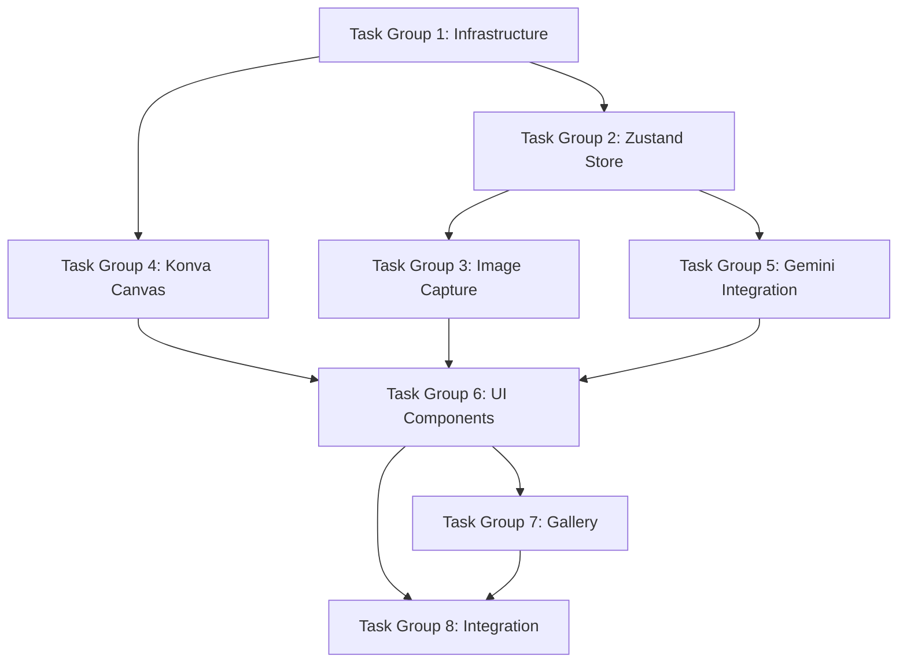

# Tasks: Site Visualizer with Gemini 3 Pro Image

> Implementation task breakdown for AI-powered site visualization

**Spec:** [spec.md](./spec.md)
**Estimated Duration:** 3-4 days
**Priority:** High (Hackathon Feature)

---

## Task Groups Overview

| Group | Name | Tasks | Priority |
|-------|------|-------|----------|
| 1 | Infrastructure & Dependencies | 4 | High |
| 2 | Zustand Store & State Management | 5 | High |
| 3 | Image Capture Integration | 4 | High |
| 4 | Konva.js Canvas & Mask Editor | 6 | High |
| 5 | Gemini 3 Pro Image Integration | 5 | High |
| 6 | UI Components | 6 | Medium |
| 7 | User Gallery & Persistence | 4 | Medium |
| 8 | Integration & Polish | 4 | Medium |

**Total Tasks:** 38

---

## Task Group 1: Infrastructure & Dependencies

### Task 1.1: Install Dependencies
- [ ] Add Zustand: `pnpm add zustand`
- [ ] Add Konva.js: `pnpm add konva react-konva`
- [ ] Add types: `pnpm add -D @types/konva`
- [ ] Verify no conflicts with existing deps

**Files:** `package.json`

### Task 1.2: Update Convex Schema
- [ ] Add `visualizations` table to schema
- [ ] Add indexes for user and parcel queries
- [ ] Run `npx convex dev` to generate types
- [ ] Verify schema deploys successfully

**Files:** `convex/schema.ts`

### Task 1.3: Create File Structure
- [ ] Create `src/stores/` directory
- [ ] Create `src/components/visualizer/` directory
- [ ] Create `convex/visualization/` directory
- [ ] Add barrel exports (`index.ts`)

**Files:** Multiple directories

### Task 1.4: Environment Setup
- [ ] Verify `GEMINI_API_KEY` in Convex environment
- [ ] Add any new env vars to `.env.example`
- [ ] Document API requirements in README

**Files:** `.env.example`, `README.md`

---

## Task Group 2: Zustand Store & State Management

### Task 2.1: Create Base Store
- [ ] Create `visualizerStore.ts` with Zustand
- [ ] Define state interface (mode, images, etc.)
- [ ] Add basic actions (setMode, reset)
- [ ] Add persist middleware for history

**Files:** `src/stores/visualizerStore.ts`

### Task 2.2: Image State Management
- [ ] Add sourceImage state and setters
- [ ] Add generatedImage state and setters
- [ ] Add maskImage state and setters
- [ ] Handle base64 encoding/decoding

**Files:** `src/stores/visualizerStore.ts`

### Task 2.3: Parcel Context State
- [ ] Add parcelId, address, coordinates state
- [ ] Add zoningContext state
- [ ] Create action to fetch zoning on capture
- [ ] Handle missing zoning data gracefully

**Files:** `src/stores/visualizerStore.ts`

### Task 2.4: History & Undo/Redo
- [ ] Implement history array with HistoryEntry type
- [ ] Add historyIndex for navigation
- [ ] Implement undo() action
- [ ] Implement redo() action
- [ ] Add canUndo/canRedo computed values

**Files:** `src/stores/visualizerStore.ts`

### Task 2.5: Generation State
- [ ] Add prompt state and setter
- [ ] Add isGenerating flag
- [ ] Add generationProgress (0-100)
- [ ] Add generationError state
- [ ] Create generate() action (calls Convex)

**Files:** `src/stores/visualizerStore.ts`

---

## Task Group 3: Image Capture Integration

### Task 3.1: Map Screenshot Capture
- [ ] Add `captureMapScreenshot()` function
- [ ] Use `map.getCanvas().toDataURL('image/png')`
- [ ] Resize to 1024x1024 if needed
- [ ] Get parcel at map center
- [ ] Connect to visualizer store

**Files:** `src/lib/mapCapture.ts`, `src/components/map/MapContainer.tsx`

### Task 3.2: Street View Capture
- [ ] Add capture button to StreetViewModal
- [ ] Get current panorama position/heading
- [ ] Fetch Static Street View image
- [ ] Convert to base64 for store
- [ ] Auto-close modal and open visualizer

**Files:** `src/components/ui/StreetViewModal.tsx`

### Task 3.3: File Upload Support
- [ ] Create file input component
- [ ] Accept PNG, JPG, WebP
- [ ] Validate file size (max 4MB)
- [ ] Convert to base64
- [ ] Resize if over 1024x1024

**Files:** `src/components/visualizer/ImageUpload.tsx`

### Task 3.4: Add Capture Triggers
- [ ] Add "Visualize" button to Header (near 3D toggle)
- [ ] Add "Visualize Site" action to ParcelCard
- [ ] Add "Visualize" option to parcel popup
- [ ] Style buttons consistently

**Files:** `src/components/shell/Header.tsx`, `src/components/copilot/ParcelCard.tsx`

---

## Task Group 4: Konva.js Canvas & Mask Editor

### Task 4.1: Basic Canvas Setup
- [ ] Create VisualizerCanvas component
- [ ] Initialize Konva Stage
- [ ] Add Layer for source image
- [ ] Handle canvas resize
- [ ] Add zoom controls (buttons or scroll)

**Files:** `src/components/visualizer/VisualizerCanvas.tsx`

### Task 4.2: Image Display Layer
- [ ] Load source image into Konva Image
- [ ] Center and scale to fit canvas
- [ ] Maintain aspect ratio
- [ ] Handle image load errors

**Files:** `src/components/visualizer/VisualizerCanvas.tsx`

### Task 4.3: Mask Layer Implementation
- [ ] Add separate Layer for mask
- [ ] Create transparent overlay
- [ ] Implement mask color (semi-transparent red/blue)
- [ ] Export mask as PNG for API

**Files:** `src/components/visualizer/VisualizerCanvas.tsx`

### Task 4.4: Brush Tool
- [ ] Track mouse/touch position
- [ ] Draw circles on mask layer
- [ ] Implement brush size state
- [ ] Show brush cursor preview
- [ ] Handle touch events for mobile

**Files:** `src/components/visualizer/VisualizerCanvas.tsx`

### Task 4.5: Eraser Tool
- [ ] Implement erase mode
- [ ] Remove from mask on paint
- [ ] Toggle between brush and eraser
- [ ] Visual indicator for active tool

**Files:** `src/components/visualizer/VisualizerCanvas.tsx`

### Task 4.6: Mask Toolbar
- [ ] Create MaskToolbar component
- [ ] Add brush/eraser toggle buttons
- [ ] Add brush size slider (5-50px)
- [ ] Add clear mask button
- [ ] Add undo/redo buttons
- [ ] Style with RetroUI neobrutalist design

**Files:** `src/components/visualizer/MaskToolbar.tsx`

---

## Task Group 5: Gemini 3 Pro Image Integration

### Task 5.1: Create Generation Action
- [ ] Create `convex/visualization/generate.ts`
- [ ] Define args schema (images, prompt, parcel)
- [ ] Call Gemini 3 Pro Image API
- [ ] Handle response parsing
- [ ] Return generated image base64

**Files:** `convex/visualization/generate.ts`

### Task 5.2: Zoning Context Builder
- [ ] Create `buildZoningContext()` function
- [ ] Fetch zoning data from parcel
- [ ] Format as natural language constraints
- [ ] Include overlays and special districts
- [ ] Handle missing data gracefully

**Files:** `convex/visualization/zoningContext.ts`

### Task 5.3: Prompt Enhancement
- [ ] Create `enhancePrompt()` function
- [ ] Combine user prompt with zoning context
- [ ] Add architectural context (Milwaukee, neighborhood)
- [ ] Add generation instructions
- [ ] Return enhanced prompt string

**Files:** `convex/visualization/zoningContext.ts`

### Task 5.4: Mask-Based Generation
- [ ] Support mask image in API call
- [ ] Format as inpainting request
- [ ] Adjust prompt for masked editing
- [ ] Test with various mask sizes

**Files:** `convex/visualization/generate.ts`

### Task 5.5: Error Handling & Retries
- [ ] Handle API errors gracefully
- [ ] Implement retry logic (max 2 retries)
- [ ] Parse error messages for user display
- [ ] Handle rate limiting (429 status)
- [ ] Log errors for debugging

**Files:** `convex/visualization/generate.ts`

---

## Task Group 6: UI Components

### Task 6.1: SiteVisualizer Container
- [ ] Create main SiteVisualizer component
- [ ] Implement as full-screen modal
- [ ] Handle mode switching (capture/edit/result)
- [ ] Add close button and navigation
- [ ] Connect to Zustand store

**Files:** `src/components/visualizer/SiteVisualizer.tsx`

### Task 6.2: ZoningSidebar
- [ ] Display parcel address
- [ ] Show zoning district badge
- [ ] List constraints (height, setbacks, FAR)
- [ ] Show overlay zone badges
- [ ] Loading state for fetching zoning
- [ ] "No zoning data" fallback

**Files:** `src/components/visualizer/ZoningSidebar.tsx`

### Task 6.3: PromptInput
- [ ] Create textarea for prompt
- [ ] Add placeholder with suggestions
- [ ] Show character count
- [ ] Add "Generate" button
- [ ] Loading state during generation
- [ ] Disable when no image loaded

**Files:** `src/components/visualizer/PromptInput.tsx`

### Task 6.4: GenerationResult
- [ ] Create side-by-side comparison view
- [ ] Implement slider comparison (optional)
- [ ] Show generation metadata (time, prompt)
- [ ] Add action buttons (Save, Download, Try Again)
- [ ] Style with RetroUI cards

**Files:** `src/components/visualizer/GenerationResult.tsx`

### Task 6.5: Loading States
- [ ] Create generation loading overlay
- [ ] Show progress indicator
- [ ] Add "Generating visualization..." message
- [ ] Animate for better UX
- [ ] Handle long generation times (>30s)

**Files:** `src/components/visualizer/GenerationLoading.tsx`

### Task 6.6: Prompt Suggestions
- [ ] Create suggestion chips component
- [ ] Add contextual suggestions based on zoning
- [ ] Examples: "Add townhomes", "Mixed-use building"
- [ ] Click to populate prompt input
- [ ] Style as clickable badges

**Files:** `src/components/visualizer/PromptSuggestions.tsx`

---

## Task Group 7: User Gallery & Persistence

### Task 7.1: Save Visualization
- [ ] Create `saveVisualization` mutation
- [ ] Upload source image to Convex storage
- [ ] Upload generated image to Convex storage
- [ ] Upload mask if exists
- [ ] Create visualization record

**Files:** `convex/visualization/save.ts`

### Task 7.2: Gallery Query
- [ ] Create `getGallery` query
- [ ] Filter by current user
- [ ] Order by createdAt descending
- [ ] Include pagination (limit/offset)
- [ ] Return with storage URLs

**Files:** `convex/visualization/gallery.ts`

### Task 7.3: Gallery UI Component
- [ ] Create VisualizationGallery component
- [ ] Display grid of saved visualizations
- [ ] Show thumbnail, title, date
- [ ] Click to view full detail
- [ ] Add delete functionality

**Files:** `src/components/visualizer/VisualizationGallery.tsx`

### Task 7.4: Download Functionality
- [ ] Implement image download
- [ ] Generate filename with date
- [ ] Add watermark "AI-generated visualization"
- [ ] Support PNG format
- [ ] Handle download on mobile

**Files:** `src/lib/downloadImage.ts`

---

## Task Group 8: Integration & Polish

### Task 8.1: HomeContent Integration
- [ ] Add visualizer modal state
- [ ] Connect capture triggers
- [ ] Pass parcel context when available
- [ ] Handle visualizer open/close

**Files:** `src/app/HomeContent.tsx`

### Task 8.2: Chat Integration
- [ ] Add "Visualize this parcel" suggestion
- [ ] Agent can offer visualization after parcel query
- [ ] Link from chat to visualizer with context

**Files:** `src/hooks/useZoningAgent.ts`

### Task 8.3: Mobile Responsiveness
- [ ] Test on mobile devices
- [ ] Adjust canvas size for mobile
- [ ] Simplify toolbar for touch
- [ ] Ensure buttons are touch-friendly
- [ ] Test capture from mobile

**Files:** Various components

### Task 8.4: Testing & Documentation
- [ ] Write unit tests for store
- [ ] Write integration tests for generation
- [ ] Test error scenarios
- [ ] Update devlog with completion
- [ ] Add usage docs to README

**Files:** `src/__tests__/`, `devlog.md`, `README.md`

---

## Verification Checklist

### Functionality
- [ ] Can capture image from map
- [ ] Can capture image from Street View
- [ ] Can upload custom image
- [ ] Mask painting works smoothly
- [ ] Generation completes successfully
- [ ] Zoning context appears in sidebar
- [ ] Can save to gallery
- [ ] Can download generated image
- [ ] Undo/redo works correctly

### Integration
- [ ] Header "Visualize" button works
- [ ] ParcelCard "Visualize Site" works
- [ ] Street View capture works
- [ ] Parcel context auto-loads

### Quality
- [ ] Generated images look reasonable
- [ ] Zoning constraints reflected in output
- [ ] UI is responsive and polished
- [ ] Error states handled gracefully
- [ ] Loading states provide feedback

---

## Dependencies

**Critical Path:** TG1 → TG2 → TG5 → TG6 → TG8

---

## Notes

- **Hackathon Priority:** Focus on TG1-TG6 first, TG7-TG8 if time permits
- **MVP:** Map capture → Mask editing → Generation → Display result
- **Nice-to-have:** Gallery, chat integration, advanced undo/redo
- **API Costs:** Monitor Gemini 3 Pro Image usage during testing
