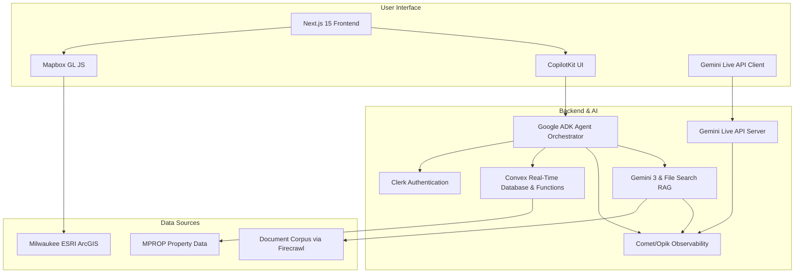

# **PRODUCT REQUIREMENTS DOCUMENT**

## **MKE.dev: Milwaukee Civic Development Intelligence Platform**

| **Project Name** | **MKE.dev** |
| :--- | :--- |
| **Hackathon** | Gemini 3 Hackathon |
| **Submission Deadline** | February 10, 2026 @ 1:00am UTC |
| **Core Innovation** | **Voice-First** (Gemini Live) + **Vision-Native** (Nano Banana) Civic AI |
| **Tech Stack** | Next.js 15, Convex, Clerk, Mapbox, Google ADK, CopilotKit, Comet/Opik |
| **Version** | 1.0 |
| **Date** | January 13, 2026 |
| **Author** | Manus, AI Product Manager |
| **Status** | Hackathon Sprint |

---

## **1. Executive Summary**

### **1.1 The Problem**

Milwaukee's civic development ecosystem is a labyrinth of fragmented information, hindering equitable access and economic growth. Critical data on zoning, financial incentives, and development permits is buried within hundreds of pages of dense PDFs and scattered across dozens of disparate municipal websites. This creates significant barriers for all stakeholders. Homeowners struggle to understand what they can build, developers cannot efficiently assess project feasibility, and architects spend countless hours on manual code-checking. The system is particularly exclusionary for visually impaired residents, for whom text-heavy, non-compliant PDFs and websites are largely inaccessible. The result is a system that favors insiders with specialized knowledge, delays or derails valuable projects, and prevents citizens and businesses from leveraging opportunities that could benefit their communities.

### **1.2 The Solution: A Voice-First Civic Intelligence Platform**

**MKE.dev** is a transformative, **voice-first and vision-enabled**, AI-powered platform designed to democratize access to Milwaukee's civic development information. It unifies the city's complex regulatory and financial data into a single, intuitive, and conversational interface. By leveraging a suite of cutting-edge technologies, MKE.dev will serve as a comprehensive copilot for residents, developers, architects, and city planners alike.

The platform's core innovations are:

*   **Conversational AI (Voice & Text):** Powered by the **Gemini Live API**, users can interact with the platform through natural, real-time voice conversations or text-based chat. This allows for hands-free operation and makes complex information accessible through simple questions.
*   **Agentic Intelligence:** A sophisticated multi-agent system, built on the **Google Agent Development Kit (ADK)**, works in the background to interpret user intent, query multiple data sources in parallel, and synthesize complex information into clear, actionable answers.
*   **Unified Knowledge Base:** The platform integrates a comprehensive knowledge base using **Gemini File Search** for Retrieval-Augmented Generation (RAG) over hundreds of official documents—including the 500+ page zoning code, 14 area plans, and various incentive policies. This corpus is kept current through automated weekly web crawls using **Firecrawl**.
*   **Interactive Spatial Analysis:** A dynamic **Mapbox** interface provides real-time visualization of spatial data from Milwaukee's **ESRI ArcGIS** services, allowing users to see zoning, TIF districts, Opportunity Zones, and city-owned properties in a rich, layered context.
*   **Generative UI:** Instead of just text, the AI agents deliver information through dynamic, interactive UI components rendered directly in the chat via **CopilotKit**, making data like feasibility reports and permit checklists easy to understand.
*   **Architectural Visualization (Nano Banana):** Powered by the **Gemini 2.5 Flash Image** model, users can generate instant, photorealistic architectural previews of proposed projects directly on a map, turning abstract ideas into tangible visualizations.

This platform aims to set a new national standard for civic technology, fostering a more equitable, efficient, and transparent development environment for the entire city of Milwaukee.

## **2. User Personas**

MKE.dev is designed to serve a diverse range of users who interact with the city's development process. Understanding their unique goals, pain points, and needs is fundamental to the platform's design.

| Persona | Role | Key Goal | Primary Pain Point | MKE.dev Value Proposition |
| :--- | :--- | :--- | :--- | :--- |
| **Maria** | Homeowner | Build an ADU for her mother | Information is overwhelming and hard to find | Simple, conversational answers to complex questions |
| **Robert** | Visually Impaired Resident | Add a wheelchair ramp to his home | Inaccessible PDFs and websites | A 100% voice-operable interface for independent navigation |
| **James** | Affordable Housing Developer | Find and analyze development sites quickly | Wasted time on manual research and feasibility studies | Proactive opportunity scouting and instant incentive analysis |
| **Sarah** | Architect | Ensure designs comply with all regulations | Tedious, manual cross-referencing of multiple documents | Centralized access to all design guidelines and zoning rules |
| **David** | City Planner | Reduce repetitive public inquiries | Spending too much time on basic, repeated questions | A self-service tool to empower citizens and free up staff time |

### **2.1 Maria — The Homeowner**

*   **Demographics:** 45-year-old teacher, first-generation homeowner in the Sherman Park neighborhood.
*   **Goals:**
    *   Build an Accessory Dwelling Unit (ADU) in her backyard for her aging mother.
    *   Understand what home improvements are allowed on her property.
    *   Find any grants or incentives she might qualify for to help with construction costs.
*   **Pain Points:**
    *   Finds the city website confusing and intimidating.
    *   Doesn't know the difference between zoning, permits, and inspections.
    *   Worried about making a mistake that could result in fines or project delays.
*   **Voice Use Case:** While cooking dinner, she asks, *"Hey MKE, can I build a small apartment for my mom in my backyard?"* The platform understands her intent, provides a clear, step-by-step answer about ADU regulations for her specific property, and generates a visual preview of what the ADU could look like in her backyard using Nano Banana.

### **2.2 Robert — The Visually Impaired Homeowner**

*   **Demographics:** 58-year-old retiree in Bay View, legally blind.
*   **Goals:**
    *   Add a wheelchair ramp to his front porch.
    *   Independently understand his property rights and obligations without relying on family members.
*   **Pain Points:**
    *   City documents are almost exclusively inaccessible PDFs.
    *   City websites have poor screen reader support, making navigation impossible.
    *   Feels a loss of autonomy, having to wait for sighted assistance for basic information gathering.
*   **Voice Use Case:** Robert uses the **voice-only interface** as his primary means of interaction. He can ask, *"Describe the setback requirements for my property at 1234 E. Russell Avenue,"* and receive a clear, auditory description of the spatial rules, enabling him to plan his project with confidence and independence.

### **2.3 James — The Developer**

*   **Demographics:** 38-year-old affordable housing developer with a small, agile firm.
*   **Goals:**
    *   Quickly identify viable development opportunities, especially city-owned or underutilized parcels.
    *   Maximize the stacking of financial incentives like Tax Incremental Financing (TIF) and Opportunity Zones (OZ).
    *   Evaluate the feasibility of a project in minutes, not weeks.
*   **Pain Points:**
    *   Manually cross-referencing TIF district maps, zoning maps, and property records is slow and error-prone.
    *   Misses out on opportunities because larger firms have more resources for site acquisition research.
    *   The pre-development and due diligence phase is too costly and time-consuming.
*   **Voice Use Case:** While driving through the Bronzeville neighborhood, he uses the app on his car's system: *"Hey MKE, show me all TIF-eligible vacant lots between 5,000 and 15,000 square feet within two blocks of my current location."* The results are displayed on the map and read aloud, allowing for hands-free prospecting.

### **2.4 Sarah — The Architect**

*   **Demographics:** 32-year-old licensed architect at a mid-size firm, focusing on urban infill projects.
*   **Goals:**
    *   Instantly verify dimensional standards (height, setbacks, Floor Area Ratio) for a given address.
    *   Ensure her designs comply with all applicable design guidelines, including historic and neighborhood-specific rules.
    *   Reduce non-billable hours spent on tedious code research.
*   **Pain Points:**
    *   Constantly switching between multiple PDF documents (zoning code, area plans, design guidelines) breaks her creative workflow.
    *   It's easy to miss a specific requirement in an overlay district or a recently amended ordinance.
    *   Answering basic feasibility questions for clients takes too long.
*   **Voice Use Case:** While sketching a concept for a new building, she asks her computer, *"Hey MKE, what's the maximum height and required ground-floor transparency at 2400 N. Farwell Avenue?"* She gets an immediate answer without having to stop sketching. She then asks, *"Show me a massing model for a 4-story building here that complies with the East Side design guidelines."* The platform uses Nano Banana to generate a context-aware 3D model directly on the map.

### **2.5 David — The City Planner**

*   **Demographics:** 50-year-old senior planner in the Department of City Development (DCD), with over 20 years of experience.
*   **Goals:**
    *   Reduce the volume of repetitive, basic inquiries from the public, which consume up to 40% of his team's time.
    *   Improve public access to planning information and foster more informed community engagement.
    *   Ensure that new development aligns with the city's adopted area plans and strategic goals.
*   **Pain Points:**
    *   Feels like a broken record, answering the same questions about setbacks and permitted uses all day.
    *   Frustrated that the valuable, forward-looking work in area plans is not easily accessible to the public.
    *   Wants to spend more time on complex, high-impact projects rather than basic customer service.
*   **Voice Use Case:** When a resident calls with a question, David can now say, *"That's a great question. For the fastest answer, just go to MKE.dev and ask it. The system has all our current zoning and can explain everything for your specific property. If you have more questions after that, feel free to call me back."*

## **3. Features and Functionality**

### **3.1 Core Platform Features**

| Feature ID | Feature Name | Description | User Benefit |
| :--- | :--- | :--- | :--- |
| CF-01 | Unified Conversational Interface | A single interface for text and voice queries, providing access to all platform capabilities. | Simplifies access to complex information, eliminating the need to navigate multiple websites. |
| CF-02 | Multi-Agent System | An orchestrated system of specialized AI agents that collaborate to answer complex queries. | Provides comprehensive, synthesized answers that draw from multiple domains (zoning, finance, etc.). |
| CF-03 | Interactive Geospatial Map | A dynamic map that visualizes zoning, incentive districts, properties, and other spatial data in real-time. | Allows users to understand the spatial context of development regulations and opportunities. |
| CF-04 | Generative UI Components | AI-generated responses are rendered as structured, interactive UI cards within the chat interface. | Presents complex data in a clear, digestible, and accessible format, improving comprehension. |
| CF-05 | Comprehensive Knowledge Base | A continuously updated corpus of all relevant city plans, codes, and policy documents. | Ensures all AI-generated answers are grounded in accurate, up-to-date, and official source material. |

### **3.2 Voice-First Interface (Gemini Live API)**

The platform will be built with a voice-first approach to maximize accessibility and provide a natural, human-like conversational experience.

| Feature ID | Feature Name | Technical Specification | User Benefit |
| :--- | :--- | :--- | :--- |
| VUI-01 | Real-Time Bidirectional Audio | Utilizes WebSockets to stream 16-bit PCM, 16kHz mono audio from the client and receive 24kHz audio from the Gemini Live API. | Enables a fluid, low-latency conversation without awkward pauses or delays. |
| VUI-02 | Natural Interruption Handling | Users can interrupt the AI mid-sentence, and the system will gracefully stop and listen. | The conversation feels more natural and human, allowing users to clarify or redirect the topic fluidly. |
| VUI-03 | Voice Activity Detection (VAD) | The system automatically detects when the user starts and stops speaking, managing the microphone input seamlessly. | Eliminates the need for push-to-talk buttons, creating a more hands-free and natural interaction. |
| VUI-04 | Sub-500ms Response Time | The system is optimized to provide responses in under 500 milliseconds, using the `gemini-2.5-flash-native-audio-preview` model. | The near-instantaneous response time mimics the cadence of a real human conversation. |
| VUI-05 | Voice-Activated Function Calling | Voice commands can trigger actions within the application, such as map navigation, layer toggling, or database queries. | Allows for powerful, hands-free control of the entire application, crucial for accessibility and multitasking. |
| VUI-06 | Secure Client-Side Authentication | Ephemeral tokens are used for client-side authentication with the Gemini Live API, ensuring no API keys are exposed in the frontend. | Protects the application and its users by adhering to security best practices. |

### **3.3 Interactive Map (Mapbox & ESRI)**

The map is the central canvas for spatial exploration and analysis, integrating dozens of live data layers from the City of Milwaukee’s ESRI ArcGIS REST services.

| Feature ID | Feature Name | Technical Specification | User Benefit |
| :--- | :--- | :--- | :--- |
| MAP-01 | Multi-Layer Visualization | Users can toggle dozens of individual data layers, including zoning, TIF districts, Opportunity Zones, BIDs, NIDs, historic districts, city-owned parcels, and vacant lots. | Provides a comprehensive and customizable view of all relevant spatial data in one place. |
| MAP-02 | 2D-to-3D View Toggle | The map will support seamless transitions between a traditional 2D top-down view and a 3D perspective with extruded building masses and terrain. | Helps users visualize the urban form and understand the physical context of development regulations. |
| MAP-03 | Parcel Context Enrichment | Clicking on any parcel will trigger a query that aggregates data from all overlapping layers, providing a complete profile of that specific property. | Delivers a holistic understanding of a single property's regulatory and incentive landscape instantly. |
| MAP-04 | Dynamic Styling & Symbology | Layers will be styled for maximum clarity, using distinct color palettes, patterns, and icons. For example, zoning will be color-coded by class (residential, commercial, etc.). | Makes complex spatial information easy to interpret at a glance. |
| MAP-05 | High-Performance Tiled Data | The integration will use libraries like `mapbox-gl-arcgis-featureserver` to handle tiled requests, ensuring smooth performance even with large datasets. | Ensures a fast, responsive map experience without long load times. |

### **3.4 AI & Agentic System (Google ADK)**

The core intelligence of MKE.dev is a multi-agent system built with the Google Agent Development Kit (ADK), where specialized agents collaborate to fulfill user requests.

| Feature ID | Feature Name | Agent(s) Responsible | Description |
| :--- | :--- | :--- | :--- |
| AI-01 | Zoning Code Interpretation | **Zoning Interpreter** | Parses the 500+ page zoning code to answer questions about permitted uses, dimensional standards, and other regulations for a specific property. |
| AI-02 | Area Plan Alignment | **Area Plan Advisor** | Assesses how a proposed project aligns with the goals and recommendations of the relevant neighborhood area plan. |
| AI-03 | Incentive Stacking Analysis | **Incentives Navigator** | Identifies all applicable financial incentives (TIF, OZ, etc.) and estimates their potential stacked value. |
| AI-04 | Property & Opportunity Search | **Real Estate Finder** | Searches city databases for available properties, vacant lots, or home building sites that match user criteria. |
| AI-05 | Design Guideline Review | **Design Advisor** | Explains applicable design guidelines, including those for historic districts and special review areas. |
| AI-06 | Permit Process Navigation | **Permit Navigator** | Outlines the required permits, approval steps, estimated timelines, and associated fees for a project. |
| AI-07 | Comprehensive Feasibility Analysis | **Feasibility Analyst** (Meta-Agent) | Orchestrates all other agents to produce a holistic feasibility report for a proposed development. |
| AI-08 | Proactive Opportunity Scouting | **Opportunity Scout** | Proactively searches for development sites that match a user's defined investment criteria. |

### **3.5 Generative UI (CopilotKit)**

To ensure complex information is delivered with maximum clarity and accessibility, the platform will use Static Generative UI. The AI agents will not just respond with text, but will render rich, interactive components in the chat.

| Component Name | Purpose | Key Information Displayed |
| :--- | :--- | :--- |
| **ZoneInfoCard** | To display a summary of a specific zoning district. | Zone code, description, key dimensional standards (height, setbacks, FAR), link to code section. |
| **ParcelAnalysisCard** | To provide a feasibility assessment for a proposed use on a specific parcel. | Address, tax key, feasibility status (Permitted, Conditional, Prohibited), requirements, next steps. |
| **IncentivesSummaryCard** | To show all available financial incentives for a location. | TIF district details, Opportunity Zone status, BID/NID info, estimated potential value. |
| **AreaPlanContextCard** | To explain how a project aligns with neighborhood plans. | Plan name, future land use designation, community goals, alignment score, relevant recommendations. |
| **PermitProcessCard** | To visualize the steps required for project approval. | Step-by-step timeline, required documents, fees, and contact information for each stage. |
| **CodeCitationCard** | To provide a direct quote and link to the source ordinance. | Code section number, title, a direct excerpt, and an explanation of its relevance. |
| **OpportunityListCard** | To list available properties that match a user's search. | Address, lot size, zoning, price, incentives, and a "match score" explaining its relevance. |

### **3.6 Architectural Visualization (Nano Banana)**

The platform will leverage the **Gemini 2.5 Flash Image** model (internally codenamed "Nano Banana") to provide users with instant, on-demand architectural visualizations, transforming abstract zoning rules into tangible visual concepts.

| Feature ID | Feature Name | Technical Specification | User Benefit |
| :--- | :--- | :--- | :--- |
| VIS-01 | On-Demand Architectural Previews | Users can request a visual preview of a potential project (e.g., "Show me a 3-story brick building here"). The system uses a Mapbox snapshot as context for an img2img generation with Gemini 2.5 Flash Image. | Allows users to "see the future" and understand how a project might look in its real-world context, making development more intuitive. |
| VIS-02 | Visual Zoning Interpretation | The system can generate simple diagrams to explain spatial concepts (e.g., "What does a 15-foot setback look like?"). | Clarifies complex regulatory language with simple, easy-to-understand visuals, improving comprehension for non-technical users. |
| VIS-03 | Style & Guideline Adherence | The `Design Advisor` agent can construct prompts for Nano Banana that incorporate specific architectural styles or design guidelines (e.g., "Cream City Brick," "East Side ARB guidelines"). | Ensures that generated previews are not just imaginative, but are grounded in the specific design context of the neighborhood. |

### **3.7 Data, Content, and Integrations**

The platform's intelligence is dependent on a robust and continuously updated knowledge base.

| Data Source | Integration Method | Update Frequency | Purpose |
| :--- | :--- | :--- | :--- |
| **Document Corpus** (PDFs) | **Gemini File Search (RAG)** | Manual (on official updates) | Forms the core knowledge base for zoning code, area plans, design guidelines, and policies. |
| **Live Web Content** | **Firecrawl** | Weekly/Daily | Keeps the knowledge base fresh with new project summaries, RFPs, and city announcements. |
| **Spatial Data Layers** | **ESRI ArcGIS REST Services** | Real-Time | Provides the live geospatial data for the interactive map. |
| **Property Data** | **Convex Database** (from MPROP) | Weekly | Provides detailed parcel information, including ownership, assessed value, and current use. |
| **User Authentication** | **Clerk** | Real-Time | Manages user accounts, login, and session handling. |
| **Real-Time Database** | **Convex** | Real-Time | Powers real-time features, stores user data, and manages serverless backend functions. |


To ensure the highest level of accuracy, reliability, and performance for our multi-agent system, MKE.dev will integrate **Comet** and its open-source library **Opik** as a comprehensive platform for LLM observability, evaluation, and optimization.

| Feature ID | Feature Name | Description | User/Developer Benefit |
| :--- | :--- | :--- | :--- |
| OBS-01 | End-to-End Traceability | All LLM calls, agent interactions, and tool usage will be logged as traces in Opik. | Provides complete visibility into the agentic workflow, enabling rapid debugging of complex multi-agent interactions. |
| OBS-02 | Performance & Quality Evaluation | The platform will use LLM-as-a-judge and heuristic metrics to continuously evaluate agent responses for accuracy, hallucination, and relevance. | Ensures the information provided to citizens is reliable and trustworthy, building confidence in the platform. |
| OBS-03 | Automated Prompt Optimization | Opik’s optimization algorithms (e.g., HRPO, MetaPrompt) will be used to automatically test and refine the system prompts for all agents. | Systematically improves the performance and accuracy of agents, reducing the need for manual prompt engineering. |
| OBS-04 | Production Monitoring & Alerting | Real-time monitoring of production traffic will identify data drift, performance degradation, or spikes in inaccurate responses. | Allows the development team to proactively address issues before they impact a large number of users. |
| OBS-05 | Cost & Latency Tracking | All calls to the Gemini API will be tracked to monitor token usage, costs, and response latency. | Provides critical data for managing operational expenses and optimizing for performance. |
| OBS-06 | User Feedback Integration | A system will be implemented to capture user feedback (e.g., thumbs up/down) on AI responses and log it directly into Opik traces. | Creates a direct feedback loop from citizens to developers, enabling data-driven improvements based on real-world usage. |

8.  [Comet - The AI Developer Platform](https://www.comet.com/site/)
9.  [Opik Documentation](https://www.comet.com/docs/opik/)

### **3.8 LLM Observability & Optimization (Comet/Opik)**

To ensure the highest level of accuracy, reliability, and performance for our multi-agent system, MKE.dev will integrate **Comet** and its open-source library **Opik** as a comprehensive platform for LLM observability, evaluation, and optimization.

| Feature ID | Feature Name | Description | User/Developer Benefit |
| :--- | :--- | :--- | :--- |
| OBS-01 | End-to-End Traceability | All LLM calls, agent interactions, and tool usage will be logged as traces in Opik. | Provides complete visibility into the agentic workflow, enabling rapid debugging of complex multi-agent interactions. |
| OBS-02 | Performance & Quality Evaluation | The platform will use LLM-as-a-judge and heuristic metrics to continuously evaluate agent responses for accuracy, hallucination, and relevance. | Ensures the information provided to citizens is reliable and trustworthy, building confidence in the platform. |
| OBS-03 | Automated Prompt Optimization | Opik's optimization algorithms (e.g., HRPO, MetaPrompt) will be used to automatically test and refine the system prompts for all agents. | Systematically improves the performance and accuracy of agents, reducing the need for manual prompt engineering. |
| OBS-04 | Production Monitoring & Alerting | Real-time monitoring of production traffic will identify data drift, performance degradation, or spikes in inaccurate responses. | Allows the development team to proactively address issues before they impact a large number of users. |
| OBS-05 | Cost & Latency Tracking | All calls to the Gemini API will be tracked to monitor token usage, costs, and response latency. | Provides critical data for managing operational expenses and optimizing for performance. |
| OBS-06 | User Feedback Integration | A system will be implemented to capture user feedback (e.g., thumbs up/down) on AI responses and log it directly into Opik traces. | Creates a direct feedback loop from citizens to developers, enabling data-driven improvements based on real-world usage. |

## **4. Technical Architecture**

The MKE.dev platform is built on a modern, scalable, and AI-native technology stack designed for performance, security, and a seamless user experience.

| Layer | Technology | Purpose |
| :--- | :--- | :--- |
| **Frontend** | Next.js 15 (React 19) | Provides a high-performance, server-component-based web application with a responsive user interface. |
| **UI Components** | RetroUI | A Neo-Brutalism React component library that provides a bold, accessible, and distinctive visual style. |
| **Frontend AI** | CopilotKit | Manages the agent-to-UI communication via the AG-UI protocol, enabling the rendering of Generative UI components. |
| **Mapping** | Mapbox GL JS | Delivers a fluid, interactive map experience with support for vector tiles, 3D terrain, and dynamic styling. |
| **Backend Logic** | Convex | A serverless, real-time database and backend platform that handles data storage, backend functions, and real-time synchronization. |
| **Authentication** | Clerk | Manages user authentication, session management, and provides secure, easy-to-use login flows. |
| **Agent Framework** | Google Agent Development Kit (ADK) | A TypeScript framework for building, orchestrating, and deploying the multi-agent system that powers the platform. |
| **AI/LLM** | Gemini 3 & Gemini Live API | The core intelligence for document understanding, RAG, function calling, and real-time, low-latency voice conversations. |
| **Vision/Image Generation** | Gemini 2.5 Flash Image (Nano Banana) | On-demand architectural visualization and style transfer for generating building previews on real sites. |
| **LLM Observability** | Comet/Opik | Provides end-to-end traceability, evaluation, and optimization for the multi-agent system. |
| **Data Ingestion** | Firecrawl | Automates the crawling of city websites and PDF repositories to keep the document corpus fresh and up-to-date. |
| **Spatial Data Source** | Milwaukee ESRI ArcGIS REST Services | Provides the live, authoritative data for all spatial layers, including zoning, parcels, and incentive districts. |

### **4.1 System Architecture Diagram**



## **5. Success Metrics**

The success of the MKE.dev platform will be measured by its ability to drive user engagement, improve access to information, and create tangible efficiencies for both the public and city staff. Key performance indicators (KPIs) will be tracked across several categories:

| Category | Metric ID | KPI | Target (Year 1) |
| :--- | :--- | :--- | :--- |
| **User Engagement** | ENG-01 | Monthly Active Users (MAU) | 5,000 |
| | ENG-02 | Average Session Duration | > 5 minutes |
| | ENG-03 | Voice Query Percentage | > 30% of all queries |
| | ENG-04 | Feasibility Reports Generated | 1,000 |
| **Accessibility & Equity** | ACC-01 | Voice-Only Sessions | > 500 sessions |
| | ACC-02 | WCAG 2.1 AA Compliance Score | 100% |
| | ACC-03 | User Satisfaction (Visually Impaired) | > 4.5 / 5.0 |
| **City Efficiency** | EFF-01 | Reduction in Repetitive Inquiries to DCD | 25% |
| | EFF-02 | Permit Application Error Rate | Decrease by 15% |
| | EFF-03 | Time to Feasibility Assessment | < 1 minute (automated) |
| **Development Impact** | DEV-01 | Opportunities Identified via Platform | 100 |
| | DEV-02 | Projects Initiated from Platform Leads | 10 |
| **AI Performance & Reliability** | AI-01 | RAG Context Recall (via Opik Evals) | > 95% |
| | AI-02 | Hallucination Rate (via Opik Evals) | < 2% |
| | AI-03 | Mean Agent Response Latency | < 3 seconds |
| | AI-04 | Critical Production Alerts (via Opik) | < 5 per month |

## **6. Development Roadmap: 4-Week Hackathon Sprint**

The project will be developed over an intensive 4-week sprint to meet the Gemini 3 Hackathon deadline of **February 10, 2026**.

### **Phase 1: Foundation & Core Intelligence (Days 1-7)**

*   **Objective:** Establish the technical foundation and core reasoning capabilities.
*   **Key Deliverables:**
    *   Initialize Next.js 15, Convex, and Clerk.
    *   Implement Mapbox with ESRI zoning and parcel layers.
    *   Run Firecrawl to ingest all core PDF documents (Zoning Code, Area Plans) into Gemini File Search.
    *   Build and test the primary `Zoning Interpreter` and `Area Plan Advisor` agents using Google ADK.
    *   Integrate Comet/Opik SDK with `@track` decorators on all agent functions.

### **Phase 2: Voice & Vision Integration (Days 8-14)**

*   **Objective:** Bring the multimodal experience to life.
*   **Key Deliverables:**
    *   Implement the real-time, bidirectional Gemini Live API for the voice interface.
    *   Build the `generateArchitecturalPreview` tool using the Gemini 2.5 Flash Image API (Nano Banana).
    *   Integrate the vision tool with the `Design Advisor` agent.
    *   Create the `VisionCard` and `ZoneInfoCard` Generative UI components in CopilotKit.

### **Phase 3: Advanced Agents & Evaluation (Days 15-21)**

*   **Objective:** Build out the advanced agentic workflows and establish evaluation pipelines.
*   **Key Deliverables:**
    *   Develop the `Feasibility Analyst` meta-agent to orchestrate the `Zoning Interpreter`, `Incentives Navigator`, and `Design Advisor`.
    *   Set up Opik evaluation datasets and run initial experiments to measure RAG accuracy and hallucination rates.
    *   Use Opik's Agent Optimizer to run at least one optimization cycle on the `Zoning Interpreter`'s main prompt.
    *   Add remaining data layers to the map (TIF, OZ, etc.).

### **Phase 4: Polish, Demo & Submission (Days 22-28)**

*   **Objective:** Refine the user experience, create submission materials, and deploy.
*   **Key Deliverables:**
    *   Conduct a full UX/UI review and polish the interface.
    *   Perform accessibility testing for voice-only navigation and screen readers.
    *   Record a compelling ~3-minute video demonstrating the full "Voice-to-Vision" workflow.
    *   Write the final text description and prepare the public code repository.
    *   Deploy the live application and submit to DevPost.

## **7. Hackathon Requirements**

This project is designed to excel across all four Gemini 3 Hackathon judging criteria.

| Judging Criterion | Weight | MKE.dev Alignment & Strategy |
| :--- | :--- | :--- |
| **Technical Execution** | 40% | The project uses a sophisticated, modern tech stack (Next.js 15, Convex, Mapbox) and deeply integrates multiple Gemini 3 APIs (Gemini 3, Gemini Live, Gemini 2.5 Flash Image). The use of Google ADK for agent orchestration and Comet/Opik for observability demonstrates a commitment to high-quality, robust development. The code will be clean, well-documented, and publicly available. |
| **Innovation / Wow Factor** | 30% | The core "Voice-to-Vision" workflow is the primary wow factor. The ability to ask a complex question in natural language, have multiple AI agents collaborate to find an answer, and then see a photorealistic architectural preview generated in seconds is a next-generation experience. This goes far beyond a simple chatbot and showcases the "Action Era" of AI that the hackathon encourages. |
| **Potential Impact** | 20% | MKE.dev addresses a critical real-world problem in civic tech: making complex regulations accessible to everyone. By democratizing development information, the platform can empower homeowners, accelerate affordable housing projects, and make cities more equitable. This is a high-impact, social good application with a clear path to scalability for other municipalities. |
| **Presentation / Demo** | 10% | The submission will feature a compelling ~3-minute video centered on Maria the Homeowner's journey, from asking a simple question to seeing a vision of her mother's new home. This narrative will clearly demonstrate the problem and the platform's powerful, human-centric solution. The PRD itself, along with the system architecture diagram, will serve as comprehensive documentation. ||

### **7.1 Hackathon Submission Checklist**

The following deliverables are required for the Gemini 3 Hackathon submission:

| Deliverable | Status | Description |
| :--- | :--- | :--- |
| Text Description (~200 words) | ☐ Pending | A brief write-up detailing which Gemini 3 features (Gemini 3, Gemini Live, Nano Banana) were used and how they are central to the application. |
| Public Project Link | ☐ Pending | A URL to the live, working MKE.dev application. Must be publicly accessible without login or paywall. |
| Public Code Repository | ☐ Pending | A URL to the GitHub repository containing all source code. |
| Demo Video (~3 min) | ☐ Pending | A compelling video demonstrating the "Voice-to-Vision" workflow, centered on Maria the Homeowner's user journey. |

### **7.2 Strategic Track Alignment**

MKE.dev aligns with multiple strategic tracks identified by the hackathon organizers:

| Strategic Track | MKE.dev Alignment |
| :--- | :--- |
| 🧠 **The Marathon Agent** | The `Feasibility Analyst` meta-agent orchestrates multiple specialized agents (Zoning, Incentives, Design) to complete complex, multi-step analysis tasks. |
| 👨‍🏫 **The Real-Time Teacher** | The Gemini Live API powers a voice-first interface that educates citizens on complex zoning regulations in real-time, adapting to their questions. |
| 🎨 **Creative Autopilot** | The integration of Nano Banana (Gemini 2.5 Flash Image) allows for on-demand, context-aware architectural visualizations. |

---

## **8. References**

1.  [Crafting Civic Tech: A Kickstarter Guide for Community…](https://medium.com/@elle_mccann/crafting-civictech-7f5edfb864bb)
2.  [A GUIDE FOR PRACTITIONERS IN CIVIC TECH](https://mitgovlab.org/wp-content/uploads/2021/04/Grassroot-MIT_Dont-Build-It_English.pdf)
3.  [How to write a product requirements document](https://www.reddit.com/r/ProductManagement/comments/nh700w/how_to_write_a_product_requirements_document/)
4.  [Voice User Interface (VUI) Design Best Practices](https://designlab.com/blog/voice-user-interface-design-best-practices)
5.  [Web Content Accessibility Guidelines (WCAG) 2.1](https://www.w3.org/TR/WCAG21/)
6.  [Fact Sheet: New Rule on the Accessibility of Web Content...](https://www.ada.gov/resources/2024-03-08-web-rule/)
7.  [Civic AI Navigator: AI Chatbot for Local Government](https://www.prometsource.com/blog/introducing-civic-ai-navigator-chatbot)
8.  [Comet - The AI Developer Platform](https://www.comet.com/site/)
9.  [Opik Documentation - Open-Source LLM Observability & Optimization](https://www.comet.com/docs/opik/)
10. [Gemini 3 Hackathon - DevPost](https://gemini3.devpost.com/)
11. [Gemini 3 Hackathon Resources](https://gemini3.devpost.com/resources)


## **9. Agent Tool Definitions**

### **9.1 Vision Tool (Nano Banana)**

```typescript
// tools/vision-tools.ts
import { FunctionTool } from '@google/adk';
import { z } from 'zod';

export const generateArchitecturalPreview = new FunctionTool({
  name: 'generate_architectural_preview',
  description: 'Generates a visual preview of a proposed building on a specific site using Nano Banana (Gemini 2.5 Flash Image).',
  parameters: z.object({
    style: z.string().describe('Architectural style (e.g., "Cream City Brick", "Modern Industrial")'),
    buildingType: z.string().describe('Type of building (e.g., "3-story mixed use", "ADU")'),
    contextImage: z.string().describe('Base64 string of the current site (satellite or street view)'),
    constraints: z.string().describe('Zoning constraints to visualize (e.g., "15ft setback")')
  }),
  execute: async ({ style, buildingType, contextImage, constraints }) => {
    // 1. Construct the prompt for Nano Banana
    const prompt = `Architectural rendering of a ${style} ${buildingType}. \
                   Context: Urban Milwaukee neighborhood. \
                   Constraints: ${constraints}. \
                   Photorealistic, eye-level view.`;

    // 2. Call Gemini 2.5 Flash Image API (Nano Banana)
    const response = await googleAI.generateImage({
      model: 'gemini-2.5-flash-image',
      prompt: prompt,
      image: contextImage // Img2Img for consistency
    });

    return { 
      imageUrl: response.url, 
      caption: `Generated preview of ${buildingType} in ${style} style.` 
    };
  }
});
```
